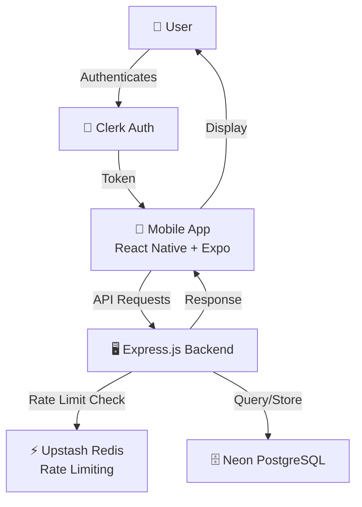
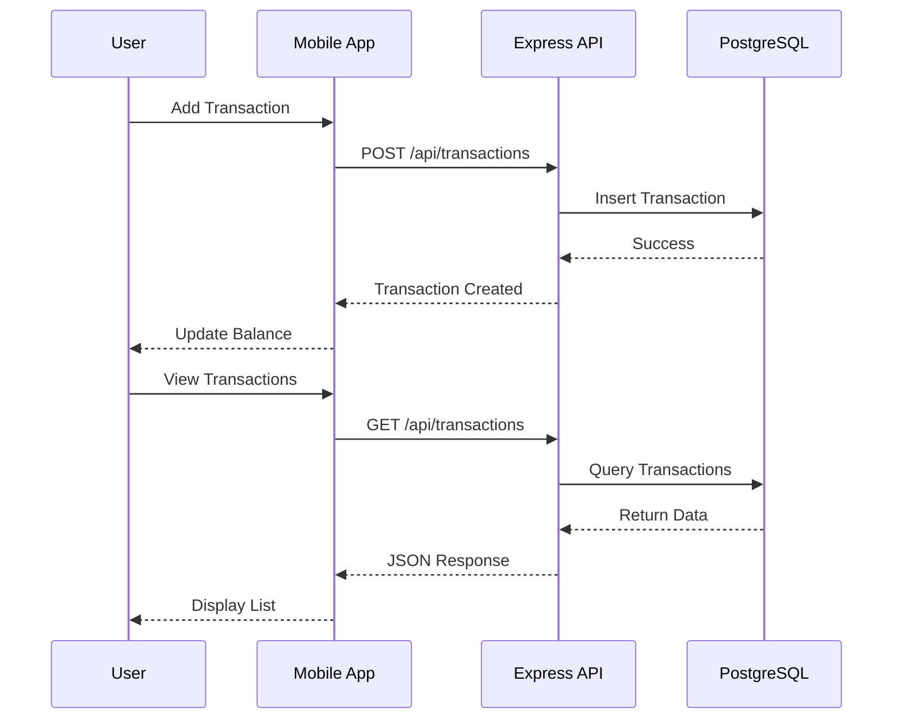
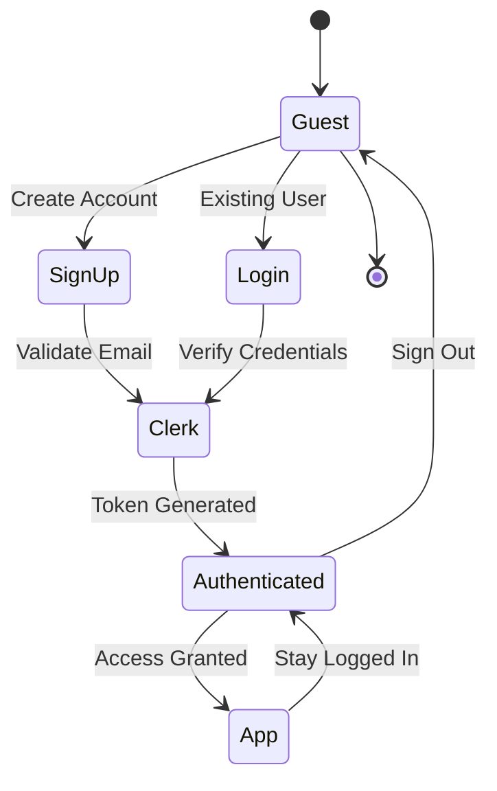
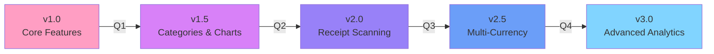

# Trackify

A modern, full-stack expense tracking application built with React Native, Expo, and Express.js. Track your spending, manage transactions, and take control of your finances with an intuitive mobile interface.

## 📱 Preview
<div align="center">
  
</div>

*Experience the sleek coffee UI of Trackify's mobile application*

---

## ✨ Features

- **Real-time Transaction Tracking** – Log and monitor your expenses instantly
- **Balance Overview** – View your current balance with an attractive card interface
- **Secure Authentication** – Powered by Clerk for secure user management
- **Responsive Mobile UI** – Beautiful gradient design optimized for all screen sizes
- **Transaction History** – Browse and manage your past transactions
- **Cross-platform Support** – Works seamlessly on iOS and Android via Expo
- **Rate Limiting & Security** – Backend protection with Upstash rate limiting
- **Database Powered** – Serverless PostgreSQL with Neon for reliable data storage

---

## 🏗️ Project Structure

```
Trackify/
├── backend/              # Express.js API server
│   ├── src/
│   │   ├── config/       # Configuration files
│   │   ├── controllers/  # Request handlers
│   │   ├── middleware/   # Express middleware
│   │   ├── routes/       # API endpoints
│   │   └── server.js     # Entry point
│   └── package.json
│
├── mobile/               # React Native Expo app
│   ├── app/              # Expo Router screens
│   │   ├── (auth)/       # Authentication screens
│   │   └── (root)/       # App screens
│   ├── components/       # Reusable components
│   ├── hooks/            # Custom React hooks
│   ├── constants/        # API & color constants
│   ├── assets/           # Images and styles
│   └── package.json
│
└── Preview/              # Marketing materials
    └── Purple Pink Gradient Mobile Application Presentation (1).mp4
```

### Architecture Overview



---

## 🚀 Getting Started

### Prerequisites

- Node.js (v16 or higher)
- npm or yarn
- Expo CLI (`npm install -g expo-cli`)
- Git

### Installation

1. **Clone the repository**
   ```bash
   git clone https://github.com/yourusername/trackify.git
   cd trackify
   ```

2. **Backend Setup**
   ```bash
   cd backend
   npm install
   ```

   Create a `.env` file in the backend directory:
   ```env
   DATABASE_URL=your_neon_database_url
   UPSTASH_REDIS_REST_URL=your_upstash_redis_url
   UPSTASH_REDIS_REST_TOKEN=your_upstash_token
   PORT=3000
   ```

   Start the backend server:
   ```bash
   npm run dev
   ```

3. **Mobile Setup**
   ```bash
   cd mobile
   npm install
   ```

   Create an `app.json` configuration and set your API endpoint in `constants/api.js`

   Start the Expo development server:
   ```bash
   npx expo start
   ```

   Scan the QR code with Expo Go app or press `i` for iOS simulator / `a` for Android emulator

---

## 📦 Tech Stack

### Backend
- **Express.js** – Fast, unopinionated web framework
- **Neon** – Serverless PostgreSQL database
- **Upstash** – Serverless Redis for rate limiting
- **Clerk** – Authentication & user management
- **Node-cron** – Scheduled tasks

### Mobile
- **React Native** – Cross-platform mobile framework
- **Expo** – Rapid development platform
- **Expo Router** – File-based routing
- **React Navigation** – Tab-based navigation
- **Clerk Expo** – Mobile authentication
- **Reanimated** – Smooth animations
- **TypeScript** – Type safety

---

## 🔐 Authentication

Trackify uses **Clerk** for secure authentication. Users can sign up, log in, and manage their account with industry-standard security practices.

### Environment Variables Needed
- `EXPO_PUBLIC_CLERK_PUBLISHABLE_KEY`
- `CLERK_API_KEY` (backend)

---

## 📡 API Endpoints

| Method | Endpoint | Description |
|--------|----------|-------------|
| POST | `/api/auth/login` | User login |
| POST | `/api/auth/signup` | User registration |
| GET | `/api/transactions` | Get all transactions |
| POST | `/api/transactions` | Create new transaction |
| GET | `/api/balance` | Get current balance |
| DELETE | `/api/transactions/:id` | Delete transaction |

### Transaction Flow



---

## 🛡️ Security Features

- **Rate Limiting** – Protected against abuse with Upstash rate limits
- **Secure Authentication** – Clerk handles OAuth and session management
- **Environment Variables** – Sensitive data stored securely
- **CORS Enabled** – Cross-origin requests properly configured

### Authentication & Security Flow



---

## 🎨 Design

The application features a modern purple and pink gradient theme with:
- Smooth animations and transitions
- Intuitive navigation with bottom tab bar
- Clean, minimalist component design
- Dark mode ready color scheme

---

## 📝 Dependencies

### Backend Dependencies
- @neondatabase/serverless@1.0.0
- @upstash/ratelimit@2.0.5
- @upstash/redis@1.34.9
- cors@2.8.5
- cron@4.3.4
- dotenv@16.5.0
- express@4.21.0
- nodemon@3.1.10

### Mobile Dependencies
- @clerk/clerk-expo@2.19.1
- @react-navigation/* – Navigation libraries
- expo@54.0.23
- react-native@0.81.5
- react@19.1.0
- typescript@5.9.3

---

## 🚀 Deployment

### Backend
Deploy to platforms like Vercel, Render, or Railway:
```bash
npm run build
npm start
```

### Mobile
Build and deploy with EAS:
```bash
eas build --platform ios
eas build --platform android
eas submit
```

---

## 🤝 Contributing

Contributions are welcome! Please follow these steps:

1. Fork the repository
2. Create a feature branch (`git checkout -b feature/amazing-feature`)
3. Commit your changes (`git commit -m 'Add amazing feature'`)
4. Push to the branch (`git push origin feature/amazing-feature`)
5. Open a Pull Request

---

## 📄 License

This project is licensed under the MIT License – see the LICENSE file for details.

---

## 💡 Future Enhancements

- [ ] Budget planning and alerts
- [ ] Expense categorization with charts
- [ ] Receipt image scanning
- [ ] Multi-currency support
- [ ] Cloud backup and sync
- [ ] Bill splitting feature
- [ ] Dark mode toggle
- [ ] Offline transaction queuing

### Development Roadmap



---

## 📧 Support

For issues, questions, or suggestions, please open an issue on GitHub or contact the development team.

---

**Built with ❤️ by the Trackify team**
